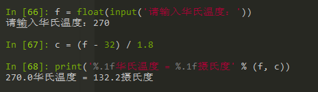
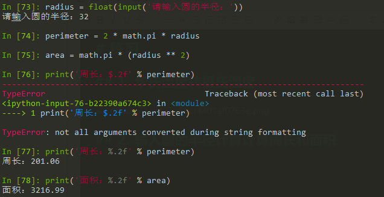
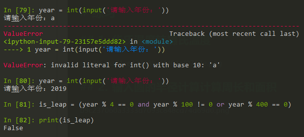

# 学习笔记

## 变量命名

- 硬性规则：
    - 变量名由字母（广义的Unicode字符，不包括特殊字符）、数字和下划线构成，数字不能开头。
    - 大小写敏感（大写的a和小写的A是两个不同的变量）。
    - 不要跟关键字（有特殊含义的单词，后面会讲到）和系统保留字（如函数、模块等的名字）冲突。
- PEP 8要求：
    - 用小写字母拼写，多个单词用下划线连接。
    - 受保护的实例属性用单个下划线开头。
    - 私有的实例属性用两个下划线开头。
 - 语义化，见名知意

## 数据类型

- Number (数字)
    - int 整数
        - Python3 中没有 Python2 的长整数类型 Long
    - float 浮动数
    - bool 布尔值
        - 布尔值为什么是整数类型？
        - True 和 False
    - complex 复数
        -  3 + 5j
- String (字符串)
    - 以单引号或双引号括起来的任意文本
    - 可以书写多行的形式（三个单引号/双引号开头和结尾）—— 和多行注释不冲突？不冲突
- List (列表) —— 未展开学习
- Tuple (元祖) —— 未展开学习
- Set (集合) —— 未展开学习
- Dictionary (字典) —— 未展开学习 

## 进制

- 0b 二进制，如 0b100 = 2 ** 2 = 4
- 0o 八进制，如 0o100 = 8 ** 2 = 64
- 0x 十六进制，如 0x100 = 16 ** 2= 256

## 字符串

### 运算符

| 操作符 | 描述                                      |
| ------ | ----------------------------------------- |
| +      | 向后拼接                                  |
| *      | 重复输出字符串                            |
| [:]    | 截取，遵循**左闭右开**原则 [0:3] = [0, 3) |
| in     | 成员运算符，返回 bool                     |
| not in | 成员运算符，返回 bool                     |
| r/R    | 输出原始字符串                            |
| %      | 格式字符串                                |

```
a = 'Hello'
print(r'\n')
#\n
print(R'\n')
#\n
print(a * 2)
# HelloHello
print(a[1:4])
#ell
```

### 字符串格式化
```
print('%d ** %d = %d' % (a, b, a ** b))
print('%d / %d = %f' % (a, b, a / b))
print('%.1f华氏度 = %.1f摄氏度' % (f, c))
```

- %d - 整数
- %f - 浮动数字， %.1f 保留1位小数位
- %s - 字符串
- 等...

## 几个内置函数

[所有内置函数](https://docs.python.org/zh-cn/3/library/functions.html)

- `type()`
- `isinstance()` 推荐使用 isinstance() 内置函数来检测对象的类型，因为它会考虑子类的情况。
- `input()` 交互式输入，读取为字符串
- `int()`
- `float()`
- `str()`
- `chr()` 返回 Unicode 码位为整数 i 的字符的字符串格式。例如，chr(97) 返回字符串 'a'
- `ord()`  对表示单个 Unicode 字符的字符串，返回代表它 Unicode 码点的整数。例如 ord('a') 返回整数 97


# 练习

## 1. 华氏温度转摄氏温度



## 2. 输入圆的半径计算计算周长和面积




## 3. 输入年份判断是不是闰年

