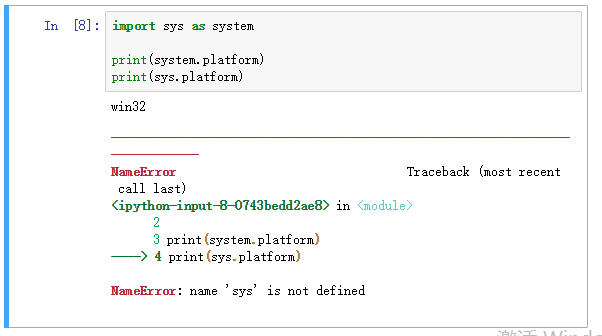
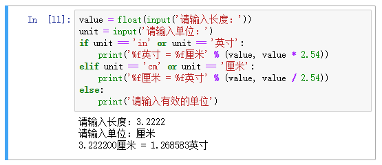
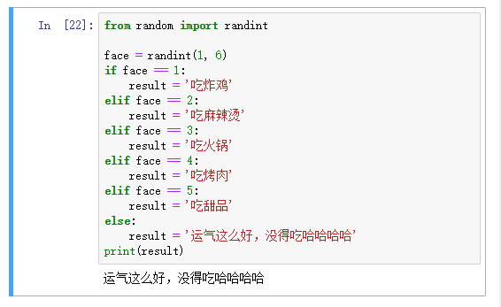
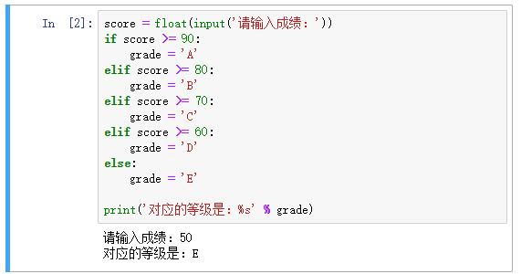
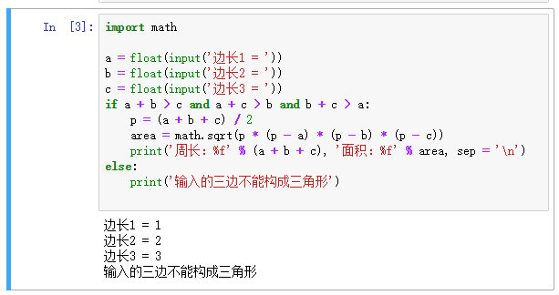
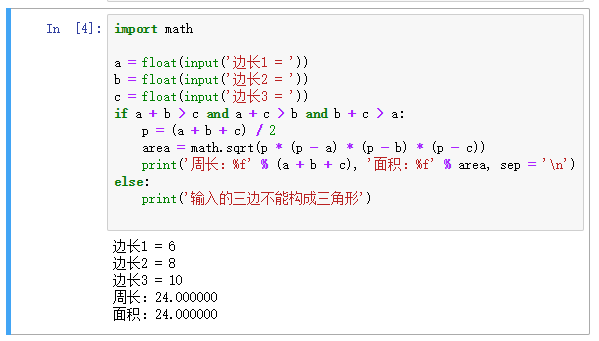
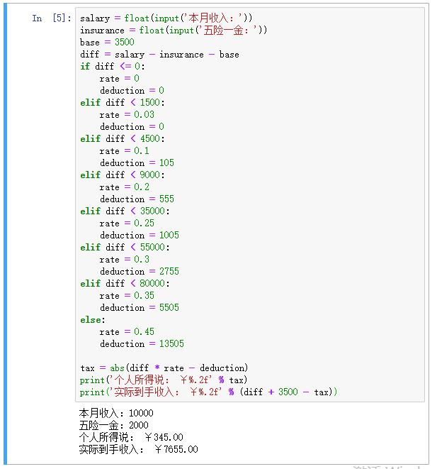

[day03](https://github.com/jackfrued/Python-100-Days/blob/master/Day01-15/Day03/%E5%88%86%E6%94%AF%E7%BB%93%E6%9E%84.md)

# 学习笔记

## 条件判断

```
if <条件判断1>:
    <执行1>
elif <条件判断2>:
    <执行2>
elif <条件判断3>:
    <执行3>
else:
    <执行4>
```

Python 完全依靠代码缩进判断上下文，为保持代码清晰，尽量扁平结构不嵌入太多层级

**Flat is better than nested.**

## 模块导入

### import 语句

### （1）基础
```
import sys
```

### (2) 多个
```
import os, sys, time
```

### (3) 别名
```
import sys as system

print(system.platform)
```
使用别名后原名不可用了




### from 语句

#### (1) 基础
```
from functools import lru_cache
```
只导入包的某个模块/部分

#### (2) 多个

逗号间隔
```
from os import path, walk, unlink
```

小括号包裹起来
```
from os import (path, walk, unlink, uname, remove, rename)
```


反斜杠是Python中的续行符，告诉解释器这行代码延续至下一行
```
from os import path, walk, unlink, uname, \
                    remove, rename
```

## 内置函数 - abs()

返回一个数的绝对值。实参可以是整数或浮点数。如果实参是一个复数，返回它的模。


# 练习

## 1. 英制单位与公制单位互换



## 2. 掷骰子决定做什么



## 3. 百分制成绩转等级制



## 4. 输入三条边长如果能构成三角形就计算周长和面积





## 5. 个人所得税计算器

