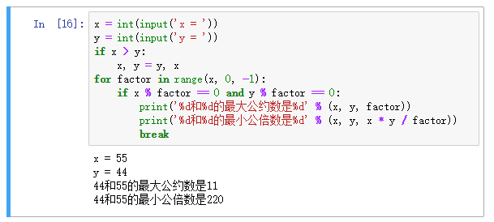
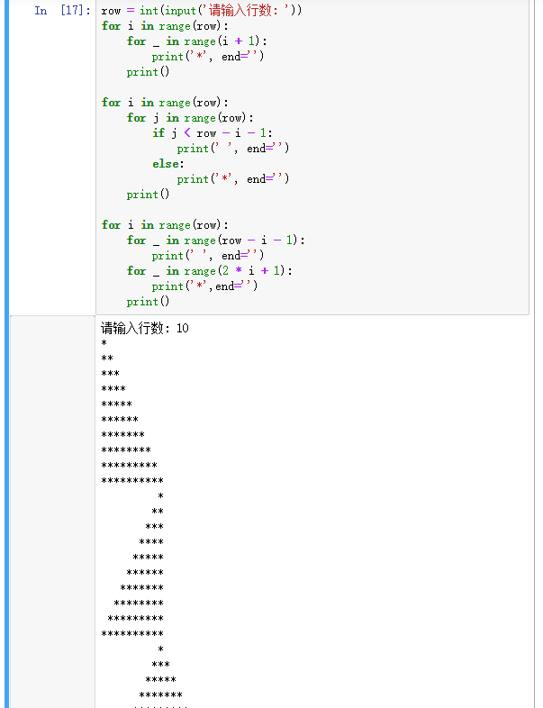

[day04](https://github.com/jackfrued/Python-100-Days/blob/master/Day01-15/Day04/%E5%BE%AA%E7%8E%AF%E7%BB%93%E6%9E%84.md)

## 学习笔记

### for-in 循环

```python
sum = 0
for x in range(101):
    sum += x
```

- `range(101)` 可以产生一个0到100的整数序列。
- `range(1, 100)` 可以产生一个1到99的整数序列。
- `range(1, 100, 2)` 可以产生一个1到99的奇数序列，其中的2是步长，即数值序列的增量。
- `range(x, 0, -1)` 倒序循环 

&nbsp;
```python
for _ in range(100)
```


_在python中称作 

丢弃变量如果不关心一个变量，就可以定义改变量的名字为_ 这是一个惯例，是一个不成文的约定，但不是标准

_是一个合法的标识符，也可以作为一个有效的变量使用，但是定义成下划线就是希望不要被使用，除非明确的知道这个数据需要使用


### while 循环

```python
while True:
    if number < answer:
        continue
    else:
        break     
```

### [Math.sqrt](https://docs.python.org/zh-cn/3/library/math.html?highlight=math%20sqrt#math.sqrt)

返回 x 的平方根

### 变量置换

```python
x, y, z = 1, 2, 'a string'
```

```python
x, y = y, x
```

### print

`print()`  即打一个换行，好用


## 练习

### 1. 输入一个数判断是不是素数



### 2. 输入两个正整数，计算最大公约数和最小公倍数


### 3. 打印三角形图案

