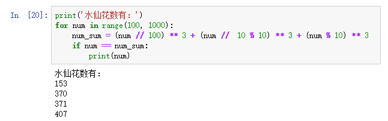
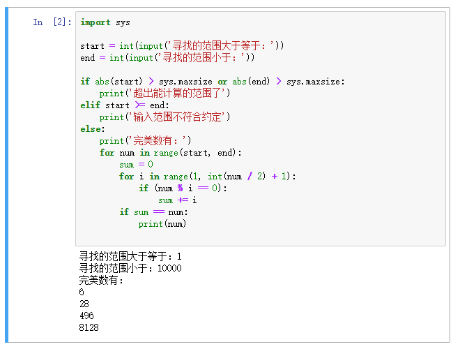
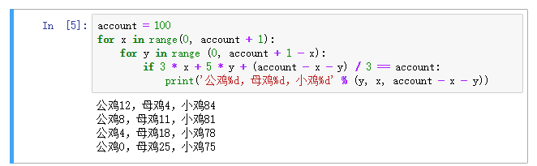
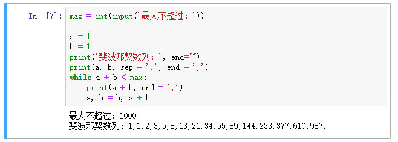
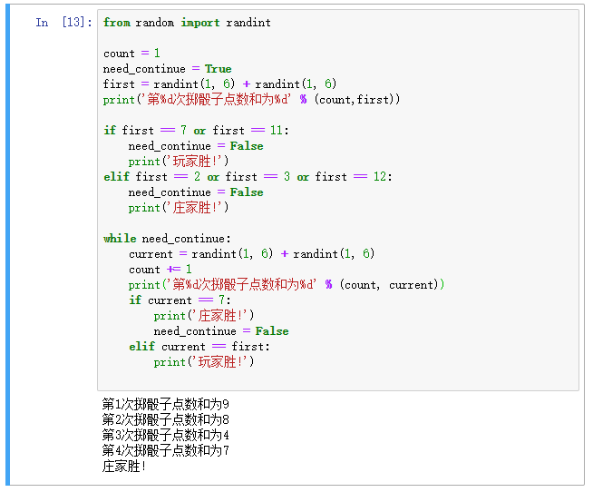

[day05](https://github.com/jackfrued/Python-100-Days/blob/master/Day01-15/Day05/%E6%80%BB%E7%BB%93%E5%92%8C%E7%BB%83%E4%B9%A0.md)

# 学习笔记

## 获取 int 最大值

```python
import sys
#i = sys.maxint
i = sys.maxsize
```

> The sys.maxint constant was removed, since there is no longer a limit to the value of integers. However, sys.maxsize can be used as an integer larger than any pratical list or string index. It conforms to the implementation’s “natural” integer size and is typically the same as sys.maxint in previous releases on the same platform (assuming the same build options).

# 练习


## 1. 寻找“水仙花数”

### 描述


水仙花数（Narcissistic number）也被称为超完全数字不变数（pluperfect digital invariant, PPDI）、自恋数、自幂数、阿姆斯壮数或阿姆斯特朗数（Armstrong number），水仙花数是指一个 3 位数，它的每个位上的数字的 3次幂之和等于它本身（例如：1^3 + 5^3+ 3^3 = 153）

### 思路

遍历三位数，逐个判断是否符合规则 abc == a ^ 3 + b ^ 3 + c ^3





## 2. 寻找“完美数”

### 描述


完全数（Perfect number），又称完美数或完备数，是一些特殊的自然数。它所有的真因子（即除了自身以外的约数）的和（即因子函数），恰好等于它本身。如果一个数恰好等于它的因子之和，则称该数为“完全数”。第一个完全数是6，第二个完全数是28，第三个完全数是496，后面的完全数还有8128、33550336等等。

### 思路

- 完美数是无线的，所以需要用户输入范围

- 遍历范围内的数，再内层遍历一级 1 ~ num / 2 找因子 

- 因子累加最后校验是否等于 num 本身 




## 3. “百钱百鸡”问题

### 描述 
我国古代数学家张丘建在《算经》一书中提出的数学问题：鸡翁一值钱五，鸡母一值钱三，鸡雏三值钱一。百钱买百鸡，问鸡翁、鸡母、鸡雏各几何？

### 思路


3x+5y+(100-x-y)/3=100

100以内遍历x和y值即可




## 4. 生成“斐波拉切数列”

### 描述


斐波那契数列（Fibonacci sequence），又称黄金分割数列、因数学家列昂纳多·斐波那契（Leonardoda Fibonacci）以兔子繁殖为例子而引入，故又称为“兔子数列”，指的是这样一个数列：1、1、2、3、5、8、13、21、34、……在数学上，斐波纳契数列以如下被以递推的方法定义：F(1)=1，F(2)=1, F(n)=F(n-1)+F(n-2)（n>=3，n∈N\*）在现代物理、准晶体结构、化学等领域，斐波纳契数列都有直接的应用，为此，美国数学会从1963年起出版了以《斐波纳契数列季刊》为名的一份数学杂志，用于专门刊载这方面的研究成果。

### 思路

- 前两位1,1是固定的

- 因为是无限的，交互上设置最大范围

- F(n)=F(n-1)+F(n-2) 线性递推数列，记录下前两个不断循环即可 




## 5. Craps赌博游戏。

### 描述


规则：玩家掷两个骰子，每个骰子点数为1-6，如果第一次点数和为7或11，则玩家胜；如果点数和为2、3或12，则玩家输庄家胜。若和为其他点数，则记录第一次的点数和，玩家继续掷骰子，直至点数和等于第一次掷出的点数和则玩家胜；若掷出的点数和为7则庄家胜。

### 思路

这个处理好if else 即可..

