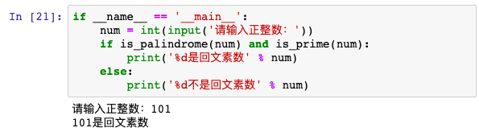

# 学习笔记


## 函数

#### 一个简单的函数
```python
def add(a, b):
    return a + b
    
print(add(1, 2))
```

如果没有return语句，函数执行完毕后也会返回结果，只是结果为 `None`。return None可以简写为return

### 空函数

```python
def nop():
    pass
```
实际上pass可以用来作为占位符，比如现在还没想好怎么写函数的代码，就可以先放一个pass，让代码能运行起来。

### 参数的默认值

```python
def add(a=0, b=0, c=0):
    return a + b + c
    
add()
```

### 可变参数

```python
def add(*args):
    total = 0
    for val in args:
        total += val
    return total
 
add(1,2,3,4,5)
```

### 关键词参数

```python
def person(name, age, **kw):
    if 'city' in kw:
        # 有city参数
        pass
    if 'job' in kw:
        # 有job参数
        pass
    print('name:', name, 'age:', age, 'other:', kw)
    
person('Bob', 35, city='Beijing')
# name: Bob age: 35 other: {'city': 'Beijing'}
```

### 参数组合

```python
def f1(a, b, c=0, *args, **kw):
    print('a =', a, 'b =', b, 'c =', c, 'args =', args, 'kw =', kw)
```

```cmd
>>> f1(1, 2, 3, 'a', 'b', x=99)
a = 1 b = 2 c = 3 args = ('a', 'b') kw = {'x': 99}
```


## 模块中的函数

> 最简单的场景就是在同一个.py文件中定义了两个同名函数，由于Python没有函数重载的概念，那么后面的定义会覆盖之前的定义，也就意味着两个函数同名函数实际上只有一个是存在的。


通过模块来区分函数
```python
import module1 as m1
import module2 as m2

m1.foo()
m2.foo()
```

## \_\_name\_\_

“Make a script both importable and executable”

> 需要说明的是，如果我们导入的模块除了定义函数之外还中有可以执行代码，那么Python解释器在导入这个模块时就会执行这些代码，事实上我们可能并不希望如此，因此如果我们在模块中编写了执行代码，最好是将这些执行代码放入如下所示的条件中，这样的话除非直接运行该模块，if条件下的这些代码是不会执行的，因为只有直接执行的模块的名字才是“__main__”。

```python
def foo():
    pass


def bar():
    pass


# __name__是Python中一个隐含的变量它代表了模块的名字
# 只有被Python解释器直接执行的模块的名字才是__main__
if __name__ == '__main__':
    print('call foo()')
    foo()
    print('call bar()')
    bar()
```

## 作用域

- Python查找一个变量时会按照“**局部作用域**”、“**嵌套作用域**”、“**全局作用域**”和“**内置作用域**”的顺序进行搜索。 

- 可以使用 `global` 关键字将变量指向全局。 

- 可以使用 `nonlocal` 关键字来指示变量来自于嵌套作用域。


## // 的妙用

int 类型除以 int 类型默认得到的是 float 类型，在明确结果是整数并且期望得到 int 类型时可以直接用 `//`， 而不是 `int(num)`

```
6 / 2 = 3.0
6 // 2 = 3
```

## if-else 极客妙用

(1)
```python
c = a if a > b else b
(x, y) = (y, x) if x > y else (x, y)
```

(2)
利用二维列表，判断结果 0/1 当作索引
```python
c = [b, a][a > b]
```

(3)
```python
c = (a > b and a or b)
```

# 练习

## 1.实现计算求最大公约数和最小公倍数的函数


## 2.实现判断一个数是不是回文数的函数


## 3.实现判断一个数是不是素数的函数


## 4.写一个程序判断输入的正整数是不是回文素数



