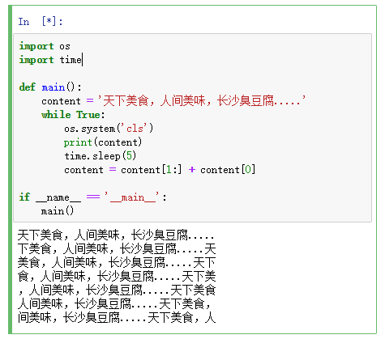
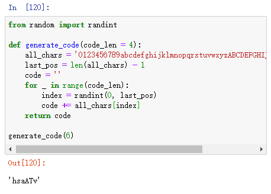
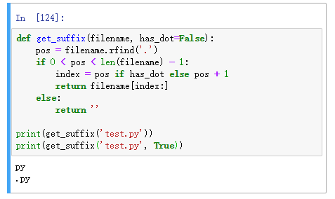
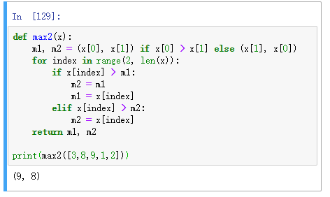
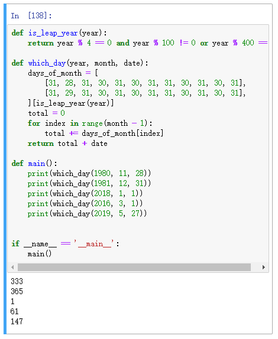

[day07](https://github.com/jackfrued/Python-100-Days/blob/master/Day01-15/Day07/%E5%AD%97%E7%AC%A6%E4%B8%B2%E5%92%8C%E5%B8%B8%E7%94%A8%E6%95%B0%E6%8D%AE%E7%BB%93%E6%9E%84.md)

## 学习笔记

今天的学习内容很长，光学习部分 jupyter 跑了100+次了... 作者给的案例都很多，跟着过一遍基本方法都了解了

- [字符串](https://docs.python.org/3/library/stdtypes.html?#text-sequence-type-str)
- [列表](https://docs.python.org/3/library/stdtypes.html?#lists)
- [元祖](https://docs.python.org/3/library/stdtypes.html?#tuples)
- [集合](https://docs.python.org/3/library/stdtypes.html?#set-types-set-frozenset)

### str.title()

```python
>>> "they're bill's friends from the UK".title()
"They'Re Bill'S Friends From The Uk"
```
返回字符串的基于标题的版本，其中单词以大写字符开头，其余字符为小写。

### 复制

```
fruites = [1,2,3,4]
# 创建指针引用
fruites3 = fruites 
# 真实复制
fruits3 = fruits[:]
```

问题：有哪些类型是创建引用，都有什么什么方式真实复制

### sorted

[sorted](https://docs.python.org/3/library/functions.html#sorted)
[sort](https://docs.python.org/3/library/stdtypes.html?#list.sort)

```
sorted(iterable, *, key=None, reverse=False)
```

**参数说明：**

- **iterable** -- 可迭代对象。
- **key** -- 主要是用来进行比较的元素，只有一个参数，具体的函数的参数就是取自于可迭代对象中，指定可迭代对象中的一个元素来进行排序。
- **reverse** -- 排序规则，reverse = True 降序 ， reverse = False 升序（默认）。


**sort 与 sorted 区别：**

sort 是应用在 list 上的方法，sorted 可以对所有可迭代的对象进行排序操作。

list 的 sort 方法返回的是对已经存在的列表进行操作，而内建函数 sorted 方法返回的是一个新的 list，而不是在原来的基础上进行的操作。

### list 生成式

```python
f = [x for x in range(1, 10)]
# 1,2,3,4,5,6,7,8,9 

f = [x + y for x in 'ABCDE' for y in '1234567']
# ['A1', 'A2', 'A3', 'A4', 'A5', 'A6', 'A7', 'B1', 'B2', 'B3', 'B4', 'B5', 'B6', 'B7', 'C1', 'C2', 'C3', 'C4', 'C5', 'C6', 'C7', 'D1', 'D2', 'D3', 'D4', 'D5', 'D6', 'D7', 'E1', 'E2', 'E3', 'E4', 'E5', 'E6', 'E7']
    
 f = [x ** 2 for x in range(1, 1000)]
# [1, 4, 9, 16, 25, 36, 49, 64, 81, 100, 121, 144, 169, 196, 225, 256, 289, 324, 361, 400, 441, 484, 529, 576, 625, 676, 729, 784, 841, 900, 961, 1024, 1089, 1156, 1225, 1296, 136 ...]
```
### sys.getsizeof

```python
sys.getsizeof(f)
```

sys模块的getsizeof函数可以用来检查一个变量所占的内存

### os.system


类似 C 中的 system() 函数，command 为os命令；

返回值在不同os上不同，Linux 返回值是执行命令的 exit 值，Window 返回值为执行命令后 shell 的返回值；

该方法无法获取到运行命令的输出；

```python
os.system('cls')
os.system('clear')
```

### random.sample

```python
random.sample(population, k)
sample(range(10000000), k=60).
```

上面使用random模块的sample函数来实现从列表中选择不重复的n个元素。

## 练习

### 1. 在屏幕上显示跑马灯文字




### 2. 设计一个函数产生指定长度的验证码，验证码由大小写字母和数字构成




### 3. 设计一个函数返回给定文件名的后缀名



### 4. 设计一个函数返回传入的列表中最大和第二大的元素的值



### 5. 计算指定的年月日是这一年的第几天

