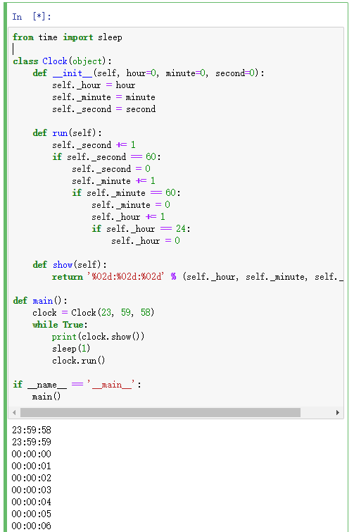
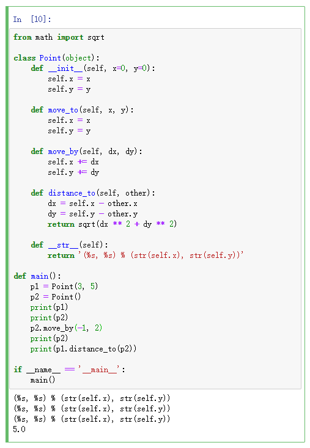

[day08](https://github.com/jackfrued/Python-100-Days/blob/master/Day01-15/Day08/%E9%9D%A2%E5%90%91%E5%AF%B9%E8%B1%A1%E7%BC%96%E7%A8%8B%E5%9F%BA%E7%A1%80.md)

## 学习笔记

### \_\_init__

在创建一个对象时默认被调用，不需要手动调用

`__init__(self)` 中，默认有1个参数名字为 `self` ，如果在创建对象时传递了2个实参，那么 `__init__(self)` 中出了 `self` 作为第一个形参外还需要2个形参，例如 `__init__(self,x,y)`

### \_\_str__

调用以下方法会由这个方法包装一层

- `str(object)`
- `format()`
- `print()`

此方法与 `object.__repr__()` 的不同点在于 `__str__()` 并不预期返回一个有效的 Python 表达式：可以使用更方便或更准确的描述信息。

内置类型 `object` 所定义的默认实现会调用 `object.__repr__()`。

### PEP 8

> PEP 8, sometimes spelled PEP8 or PEP-8, is a document that provides guidelines and best practices on how to write Python code. It was written in 2001 by Guido van Rossum, Barry Warsaw, and Nick Coghlan. The primary focus of PEP 8 is to improve the readability and consistency of Python code.

代码风格规范

[参考文档](https://www.python.org/dev/peps/pep-0008/)

### is 和 ==

在 Python 中一切都是对象，整数也是对象，在比较两个整数时有两个运算符 `==` 和 `is` ，它们的区别是：

`is` 比较的是两个整数对象的id值是否相等，也就是比较两个引用是否代表了内存中同一个地址。
`==` 比较的是两个整数对象的内容是否相等，使用 `==` 时其实是调用了对象的 `__eq__()` 方法。

那正好昨天那个问题得到了解释：

**Python中，万物皆对象！万物皆对象！万物皆对象！**

&nbsp;

知识点补充：

出于对性能的考虑，Python内部做了很多的优化工作，对于整数对象，Python把一些频繁使用的整数对象缓存起来，保存到一个叫small_ints的链表中，在Python的整个生命周期内，任何需要引用这些整数对象的地方，都不再重新创建新的对象，而是直接引用缓存中的对象。Python把这些可能频繁使用的整数对象规定在范围 **[-5, 256]** 之间的小对象放在small_ints中，但凡是需要用些小整数时，就从这里面取，不再去临时创建新的对象。

## 练习

### 1. 定义一个类描述数字时钟

### 2. 定义一个类描述平面上的点并提供移动点和计算到另一个点距离的方法

