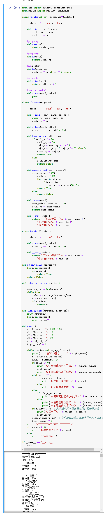

[day09](https://github.com/jackfrued/Python-100-Days/blob/master/Day01-15/Day09/%E9%9D%A2%E5%90%91%E5%AF%B9%E8%B1%A1%E8%BF%9B%E9%98%B6.md)

## 学习笔记

### 属性 @property


1. 作为一个方法的装饰器来使用。这可以让你将一个类方法转变成一个类属性。
2. 取代 setter 和 getter 方法, 还有 deleter

```python

class C(object):
    def __init__(self): self._x = None

    @property
    def x(self):
        """I'm the 'x' property."""
        return self._x

    @x.setter
    def x(self, value):
        self._x = value

    @x.deleter
    def x(self):
        del self._x
```

问题： deleter 是怎样的场景？

### 静态方法 @staticmethod @classmethod


一般来说，要使用某个类的方法，需要先实例化一个对象再调用方法。

而使用 `@staticmethod` 或 `@classmethod` ，就可以不需要实例化，直接 `类名.方法名()` 来调用。这有利于组织代码，把某些应该属于某个类的函数给放到那个类里去，同时有利于命名空间的整洁。

从它们的使用上来看,

- `@staticmethod` 需要表示自身对象的 self 和自身类的 cls 参数，就跟使用函数一样。

- `@classmethod` 也不需要self参数，但第一个参数需要是表示自身类的` cls` 参数。

如果在`@staticmethod` 中要调用到这个类的一些属性方法，只能直接` 类名.属性名` 或 `类名.方法名`。

而 `@classmethod` 因为持有cls参数，**可以来调用类的属性，类的方法，实例化对象等**，避免硬编码。

### __slots__


特殊属性`__slots__` 允许您在代码中**显式地声明期望对象实例具有的实例属性**，以及预期的结果：

> 更快的属性访问
> 内存中的潜在空间节省

如果我们需要限定自定义类型的对象只能绑定某些属性，可以通过在类中定义__slots__变量来进行限定。

需要注意的是__slots__的限定只对当前类的对象生效，对子类并不起任何作用。

```python
class Person(object):
    __slots__ = ('_name', '_age')
```

### 调用实例方法

1. 实例.方法(参数)
2. 类.方法(实例)

问题：第二种方式怎么传参呢？
        

### 继承

```python
class Student(Person):
```

### 抽象类 abc.ABCMeta

使用该元类以创建抽象基类。抽象基类可以像 mix-in 类一样直接被子类继承。你也可以将不相关的具体类（包括内建类）和抽象基类注册为“抽象子类” —— 这些类以及它们的子类会被内建函数 issubclass() 识别为对应的抽象基类的子类，但是该抽象基类不会出现在其 MRO（Method Resolution Order，方法解析顺序）中，抽象基类中实现的方法也不可调用（即使通过 super() 调用也不行）。

```pyton
class Fighter(object, metaclass=ABCMeta):
    pass
```

### 抽象 @abc.abstractmethod


使用此装饰器要求类的元类是 ABCMeta 或是从该类派生。一个具有派生自 ABCMeta 的元类的类不可以被实例化，除非它全部的抽象方法和特征属性均已被重载。抽象方法可通过任何普通的“super”调用机制来调用。 abstractmethod() 可被用于声明特性属性和描述器的抽象方法。

```
class Fighter(object, metaclass=ABCMeta):
  
    @abstractmethod
    def attack(self, other):
        pass
```

## 练习

### 1. 奥特曼打小怪兽

