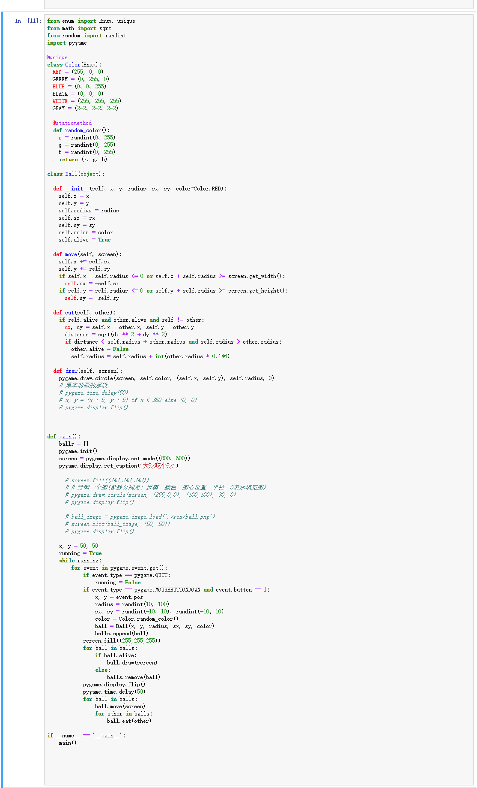

[day10](https://github.com/jackfrued/Python-100-Days/blob/master/Day01-15/Day10/%E5%9B%BE%E5%BD%A2%E7%94%A8%E6%88%B7%E7%95%8C%E9%9D%A2%E5%92%8C%E6%B8%B8%E6%88%8F%E5%BC%80%E5%8F%91.md)

## 学习笔记

### tkinter 模块

Tk图形用户界面(GUI)

>Python程序员可以通过 tkinter 包和它的扩展， tkinter.tix 模块和 tkinter.ttk 模块，来使用这套鲁棒的、平台无关的窗口工具集。
>
>tkinter 最大的优点就一个字：快，再一个，是Python自带的。尽管官方文档不太完整，但有其他资源可以参考，比如Tk手册，教程等。 tkinter 也以比较过时的外观为人所知，但在Tk 8.5中，这一点得到了极大的改观。

#### tkinter.messagebox

在 `tkinter.messagebox` 中的几个方法设计和命名挺好的，值得参考

- askokcancel(title=None, message=None, \*\*options)  确定、取消
- askquestion(title=None, message=None, \*\*options)  是、否
- askretrycancel(title=None, message=None, \*\*options) 重试、取消
- askyesno(title=None, message=None, \*\*options)
- askyesnocancel(title=None, message=None,\*\*options)
- showerror(title=None, message=None, \*\*options)
- showwarning(title=None, message=None, \*\*options)

#### tkinter.mainloop


`mainloop`  就进入到事件（消息）循环。GUI 应用通常是事件驱动式的，之所以要进入主事件循环就是要监听事件。
一旦检测到事件，就刷新组件。譬如你输入一个字符，就要立即在光标那个位置显示出来（前提是你选中了文本框，也就是鼠标在文本框这个图案的范围内单击过）。又譬如你点了首页这个按钮（就是在这个图形的区域附近单击）那么就要清除你浏览器里的全部部件，然后重新绘制（按照主页设计的布局和内容）。

#### 布局管理器


kinter 有三种布局管理方式:

- pack （自动将控件填充到合适的位置）
- grid （基于网格坐标来摆放控件）
- place （开发者提供控件的大小和摆放位置


这三种布局管理在同一个 master window 里一定不可以混用! 布局管理有以下功能:

- 将控件放置在屏幕上,包括控件的位置及控件的大小
- 将控件注册到本地窗口系统中
- 管理控件在屏幕上的显示

具体不学习了，下次用到看[教程](https://blog.csdn.net/liuxu0703/article/details/54428405)


### Pygame 模块

>Pygame是一个开源的Python模块，专门用于多媒体应用（如电子游戏）的开发，其中包含对图像、声音、视频、事件、碰撞等的支持。Pygame建立在SDL的基础上，SDL是一套跨平台的多媒体开发库，用C语言实现，被广泛的应用于游戏、模拟器、播放器等的开发。而Pygame让游戏开发者不再被底层语言束缚，可以更多的关注游戏的功能和逻辑。

###  enum 模块

`enum` 是 Python 用来创建枚举形态的标准库，通过其中的`Enum` 类可以创建枚举类

其中的 `@unique` 装饰器是专门用于枚举的， 它会自动检查 `__members__` 的值，如果有重复会报错

```python
>>> from enum import Enum, unique
>>> @unique class Mistake(Enum):
            ONE = 1
            TWO = 2
            THREE = 3
            FOUR = 3
            
Traceback (most recent call last):
...
ValueError: duplicate values found in <enum 'Mistake'>: FOUR -> THREE
```

### nonlocal 


`nonlocal关键字`：与 `global 关键字` 有点相似，可以对比着理解。

`nonlocal 关键字` 只能作用域局部变量，且**始终找离当前最近的上层局部作用域中的变量**。看栗子：

```python
a = 1
def outer():
    nonlocal a
    a = 2
outer()
print(a)

#报错    SyntaxError: no binding for nonlocal 'a' found
```
此时外层局部作用域虽然能找到变量a，但是这找到的 这个a 已经被global声明为全局变量了，所以报错

### not 非的转化

```python
flag = not flag
```

## 练习


