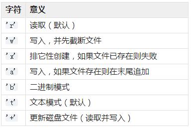

[day11](https://github.com/jackfrued/Python-100-Days/blob/master/Day01-15/Day11/%E6%96%87%E4%BB%B6%E5%92%8C%E5%BC%82%E5%B8%B8.md)

## 学习笔记

### 内置函数 open ， 文件读写操作

```
open(file, mode='r', buffering=-1, encoding=None, errors=None, newline=None, closefd=True, opener=None)
```

mode 有：



- 默认的模式是 'r' （打开并读取文本，同 'rt' ）

- 在文本模式，如果 encoding 没有指定，则根据平台来决定使用的编码：使用 locale.getpreferredencoding(False) 来获取本地编码。（要读取和写入原始字节，请使用二进制模式并不要指定 encoding。） 

- 如果该文件不能打开，则触发 [OSError](https://docs.python.org/zh-cn/3/library/exceptions.html#OSError)

### 异常捕获

在 Python 中，所有异常必须为一个派生自 [BaseException](https://docs.python.org/zh-cn/3/library/exceptions.html#BaseException) 的类的实例。

通过如下方式捕捉异常：

```python
try:
    ...
except SomeException:
    ....
```

进一步的例子

```python
try:
    f = open('test.txt', 'r', encoding='utf-8')
    print(f.red())
except FileNotFoundError as e:
    print('can not find ths file')
except LookupError as e:
    print('unknown encoding')
except UnicodeDecodeError as e:
    print('decode file error')
finally:
    if f:
        f.close()
```

- 当 `try` 子句中发生异常时，将启动对异常处理器的搜索。 此搜索会依次检查 `except` 子句，直至找到与该异常相匹配的子句。 如果存在`无表达式的 except 子句`，它必须是最后一个；它将匹配任何异常。 

- 当使用 `as` 将目标赋值为一个异常时，它将在 `except` 子句结束时被清除。 这就相当于

```python
except E as N:
    foo
```

被转写为

```python
except E as N:
    try:
        foo
    finally:
        del N
```

### with 语句

> with 语句用于包装带有使用上下文管理器定义的方法的代码块的执行。 这允许对普通的 try...except...finally 使用模式进行封装以方便地重用。

有点迷

一个例子，看起来是对 open 执行结果包装赋值给 f 并形成一个代码块，官方的语句执行过程没理解明白，这其中跟 try...except...finally 有share关系？

```python
with open('test.txt', 'r', encoding='utf-8') as f
```

&nbsp;

多个 with 语句时，实际是嵌套

```python
with A() as a, B() as b:
    suite
```

等于

```python
with A() as a:
    with B() as b:
        suite
```


### assert

```python
assert condition
```

提供简单直白的断言功能， 如果不符合则抛出错误，比下面这种写法好：

```python
if not condition:
    ...
```

### json 模块


json模块主要有四个比较重要的函数，分别是：

- **dump** - 将Python对象按照JSON格式序列化到文件中
- **dumps** - 将Python对象处理成JSON格式的字符串
- **load** - 将文件中的JSON数据反序列化成对象
- **loads** - 将字符串的内容反序列化成Python对象


    这里出现了两个概念，一个叫序列化，一个叫反序列化。自由的百科全书维基百科上对这两个概念是这样解释的：“序列化（serialization）在计算机科学的数据处理中，是指将数据结构或对象状态转换为可以存储或传输的形式，这样在需要的时候能够恢复到原先的状态，而且通过序列化的数据重新获取字节时，可以利用这些字节来产生原始对象的副本（拷贝）。与这个过程相反的动作，即从一系列字节中提取数据结构的操作，就是反序列化（deserialization）”

更加详细的[文档](https://docs.python.org/zh-cn/3/library/json.html?highlight=json#module-json)

### 第三方 requests 库

> Requests 的哲学是以 PEP 20 的习语为中心开发的，所以它比 urllib 更加 Pythoner

[文档](https://2.python-requests.org//zh_CN/latest/)

```python

>>> r = requests.get('https://api.github.com/user', auth=('user', 'pass'))
>>> r.status_code200
>>> r.headers['content-type']
'application/json; charset=utf8'
>>> r.encoding
'utf-8'
>>> r.textu
'{"type":"User"...'
>>> r.json()
{u'private_gists': 419, u'total_private_repos': 77, ...}
```

翻看了下文档，很厉害的样子

## 练习

今天没有练习，测试见 [day11](./code/day11.ipynb)