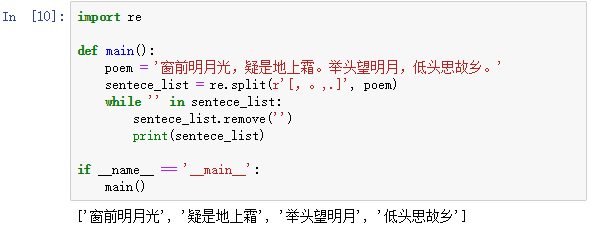

[day12](https://github.com/jackfrued/Python-100-Days/blob/master/Day01-15/Day12/%E5%AD%97%E7%AC%A6%E4%B8%B2%E5%92%8C%E6%AD%A3%E5%88%99%E8%A1%A8%E8%BE%BE%E5%BC%8F.md)

## 学习笔记

正则表达式原本就比较熟悉，这块不再学习

### re 模块

[文档](https://docs.python.org/zh-cn/3/library/re.html)

该模块下几个重要方法

- re 模块的正则表达式相关函数中都有一个 `flags` 参数，它代表了正则表达式的匹配标记，可以通过该标记来指定匹配时是否忽略大小写、是否进行多行匹配、是否显示调试信息等。如果需要为 flags 参数指定多个值，可以使用按位或运算符进行叠加，如 `flags=re.I | re.M`

## 练习

### 1. 验证输入用户名和QQ号是否有效并给出对应的提示信息

### 2. 从一段文字中提取出国内手机号码。

### 3. 替换字符串中的不良内容

### 4. 拆分长字符串

