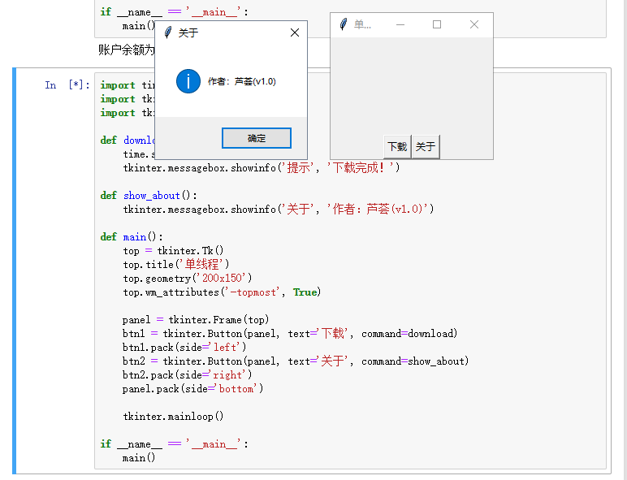

[day13](https://github.com/jackfrued/Python-100-Days/blob/master/Day01-15/Day13/%E8%BF%9B%E7%A8%8B%E5%92%8C%E7%BA%BF%E7%A8%8B.md)


## 学习笔记

### 进程与线程


多线程是 `multi threading`，而多进程是 `multi processing`。线程与进程的区别我们在操作系统中已经学习过了，简而言之，进程可以包含多个线程，而线程是进程的一个实体。开线程的代价比开进程的代价小，而且便于通信，但是多进程更稳定一些，毕竟一个线程crash了，整个进程都会挂，而多进程之间通常是独立的。有人看到这可能有疑问，如果我处理好线程安全性的问题，那直接用多线程不就好了。

### 进程 fork and spawn

- **Unix系统**下默认的实现方式是 `fork`，而 `fork` 可以将进程复制一份，子进程可以执行与主程序不同的函数，此外，这种方式生成的进程继承了父进程的数据，所以数据可以方便的从父进程流动到子进程。
- **而在Windows上**不支持fork，而是要使用 `spawn`。`spawn` 其实也是将进程复制一份，但是进程会重新执行一遍主函数里面的代码，就像父进程一样，然后再去执行相应的函数 


这就会导致一个问题就是如果我们不加任何判断的话，这个进程会不断的复制自身，形成新的进程。

Python的设计者当然考虑到了这一点，所以如果你在spawn进程的初始阶段还尝试创建新进程的话，会报错退出。

怎么区别主进程和父进程呢？一般会采用__name__属性来区分。


### 进程间通信机制（IPC，Inter-Process Communication）


进程间通讯的方法有：管道，消息队列，共享内存，信号，信号量，套接字

像我熟悉的 Node 使用的是管道通信


这块有机会还可以展开学学


### multiprocessing 模块

[完整文档](https://docs.python.org/zh-cn/3/library/multiprocessing.html?highlight=multiprocessing)

1. 要选择一个启动方法，你应该在主模块的 `if __name__ == '__main__' `子句中调用 `set_start_method()`

```python

import multiprocessing as mp

def foo(q):
    q.put('hello')

if __name__ == '__main__':
    mp.set_start_method('spawn')
    q = mp.Queue()
    p = mp.Process(target=foo, args=(q,))
    p.start()
    print(q.get())
    p.join()
```

2. 进程间数据通信支持 **管道 Pipe()** 和 **队列 Queue()**

3. 可以使用锁来确保一次只有一个进程打印到标准输出。不使用来自不同进程的锁输出容易产生混淆。

```python

from multiprocessing import Process, Lock

def f(l, i):
    l.acquire()
    try:
        print('hello world', i)
    finally:
        l.release()

if __name__ == '__main__':
    lock = Lock()

    for num in range(10):
        Process(target=f, args=(lock, num)).start()
```


4. 进程间的共享状态（应尽量避免）： 共享内存（可以使用 Value 或 Array 将数据存储在共享内存映射中）、服务器进程（Manager()）

```python

from multiprocessing import Process, Value, Array

def f(n, a):
    n.value = 3.1415927
    for i in range(len(a)):
        a[i] = -a[i]

if __name__ == '__main__':
    num = Value('d', 0.0)
    arr = Array('i', range(10))

    p = Process(target=f, args=(num, arr))
    p.start()
    p.join()

    print(num.value)
    print(arr[:])
```

### threading 模块

[完整文档](https://docs.python.org/zh-cn/3/library/threading.html?highlight=thread)

在Python早期的版本中就引入了thread模块（现在名为_thread）来实现多线程编程，然而该模块过于底层，而且很多功能都没有提供，因此目前的多线程开发使用threading模块，该模块对多线程编程提供了更好的面向对象的封装。

1. 可以通过继承Thread类的方式来创建自定义的线程类，然后再创建线程对象并启动线程

```python
# TODO
```

2. 守护进程 daemon 一定要在调用 start() 前设置好，不然会抛出 RuntimeError 。初始值继承于创建线程；主线程不是守护线程，因此主线程创建的所有线程默认都是 daemon = False。


3. 锁： 在Python中，它是能用的最低级的同步基元组件，由 \_thread 扩展模块直接实现。
    当多个线程在 acquire() 等待状态转变为未锁定被阻塞，然后 release() 重置状态为未锁定时，只有一个线程能继续执行；至于哪个等待线程继续执行没有定义，并且会根据实现而不同。
    
    
```python
from threading import Thread, Lock

self._lock.acquire()
self._lock.release()
```

### os 模块的 getpid

返回当前进程ID


## 什么场景需要多任务 


是否采用多任务的第二个考虑是任务的类型，可以把任务分为**计算密集型**和**I/O密集型**。

计算密集型任务的特点是要进行大量的计算，消耗CPU资源，比如对视频进行编码解码或者格式转换等等，这种任务全靠CPU的运算能力，虽然也可以用多任务完成，但是任务越多，花在任务切换的时间就越多，CPU执行任务的效率就越低。

计算密集型任务由于主要消耗CPU资源，这类任务用Python这样的脚本语言去执行效率通常很低，最能胜任这类任务的是C语言，我们之前提到了Python中有嵌入C/C++代码的机制。

&nbsp;

除了计算密集型任务，其他的涉及到网络、存储介质I/O的任务都可以视为I/O密集型任务，这类任务的特点是CPU消耗很少，任务的大部分时间都在等待I/O操作完成（因为I/O的速度远远低于CPU和内存的速度）。

对于I/O密集型任务，如果启动多任务，就可以减少I/O等待时间从而让CPU高效率的运转。有一大类的任务都属于I/O密集型任务，这其中包括了我们很快会涉及到的网络应用和Web应用。


## 练习

### 1. 将耗时间的任务放到线程中以获得更好的用户体验




### 2. 使用多进程对复杂任务进行“分而治之”


