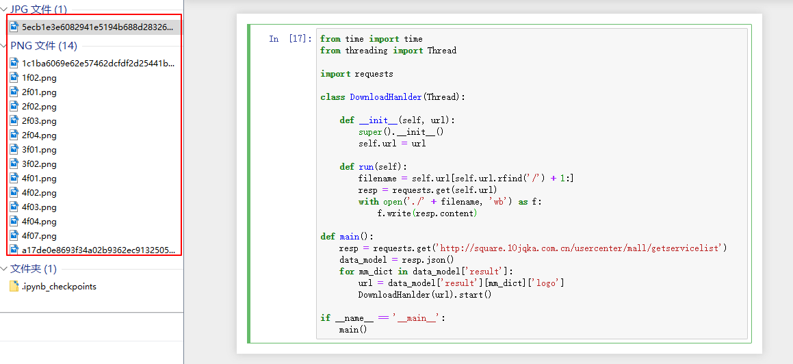
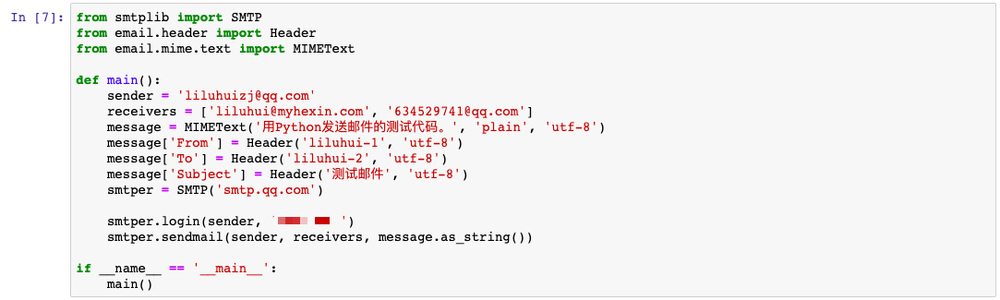
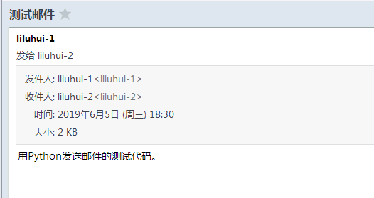
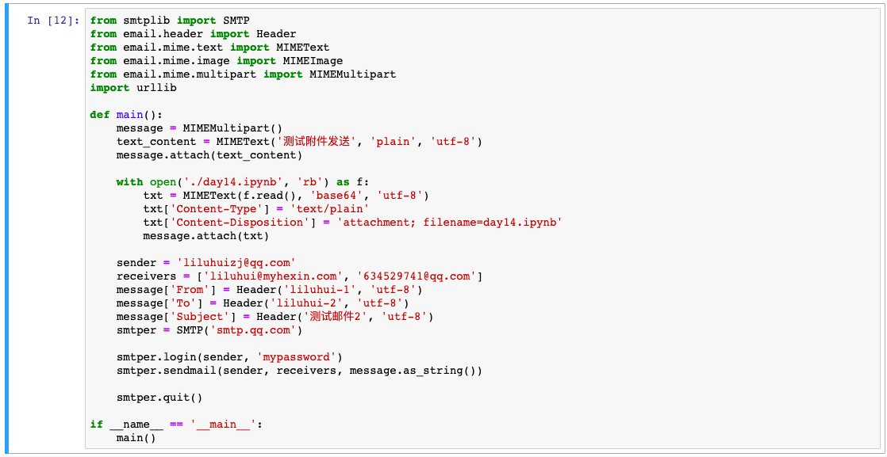
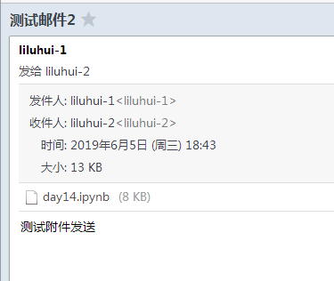

[day14](https://github.com/jackfrued/Python-100-Days/blob/master/Day01-15/14.%E7%BD%91%E7%BB%9C%E7%BC%96%E7%A8%8B%E5%85%A5%E9%97%A8%E5%92%8C%E7%BD%91%E7%BB%9C%E5%BA%94%E7%94%A8%E5%BC%80%E5%8F%91.md)

[套接字变成指南](https://docs.python.org/zh-cn/3/howto/sockets.html)


## 学习笔记

### str.rfind

```
str.rfind(sub[, start[, end]])
```

返回子字符串 sub 在字符串内被找到的最大（最右）索引

### datetime.now

```
datetime.now(tz=None)
```

对比 `today()` 、 `time.time()`  的差别是？

 - `tz` 不指定，则和 `today()`  一样
 -  比 `time.time()`  可计算精度更高

### socket —— 底层网络接口

这个模块提供了访问BSD\*套接字\*的接口。在所有现代Unix系统、Windows、macOS和其他一些平台上可用。

[完整文档](https://docs.python.org/zh-cn/3/library/socket.html?highlight=socket#module-socket)

(1) 创建套接字实例

```
# family=AF_INET - IPv4地址
# family=AF_INET6 - IPv6地址
# type=SOCK_STREAM - TCP套接字
# type=SOCK_DGRAM - UDP套接字
# type=SOCK_RAW - 原始套接字
socket.socket(family=AF_INET, type=SOCK_STREAM, proto=0, fileno=None)
```

(2) 绑定 IP 地址和端口

```
socket.bind(address)
```

(3) 使服务器接受连接

```
socket.listen([backlog])
```

`backlog`  指定在拒绝新连接之前系统将允许的未接受连接数。

(4) 客户端接收连接

```
socket.accept()
```

下面是指定接收数据的大小
```
socket.recv(bufsize[, flags])
```

问题： 为什么需要 decode ？ 

```python
client = socket()
client.connect(('192.168.1.2', 6789))
client.recv(1024).decode('utf-8')
```

### message.as_string()

```
as_string(unixfrom=False, maxheaderlen=None, policy=None)
```

[EmailMessage](https://docs.python.org/zh-cn/3/library/email.message.html#email.message.EmailMessage) 提供这个方法将消息对象格式化为字符串，同样的还有 `str(aMessage)`

### smtplib —— SMTP协议客户端

```
smtplib.SMTP(host='', port=0, local_hostname=None, [timeout, ]source_address=None)
```

```python
from smtplib import SMTP
from email.mime.text import MIMEText

sender = 'liluhuizj@qq.com', 
receiver = '634529741@qq.com'
message = MIMEText('用Python发送邮件的示例代码.', 'plain', 'utf-8')
smtper = SMTP('smtp.qq.com')
smtper.login(sender, 'mypassword')
smtper.sendmail(sender, receiver, message.as_string())
smtper.quit()
```

### urllib --- URL 处理模块

方法不多~

- `urllib.request` 打开和阅读 URLs
- `urllib.error` 包含 urllib.request 抛出的异常
- `urllib.parse` 用于处理 URL
- `urllib.robotparse`r 用于解析 robots.txt 文件 

&nbsp;

如下转为url参数拼接并转码为ASCII字符串

```python
urllib.parse.urlencode({
    "account": "a",
    "password": "a",
    "content": "这是一条用Python程序发出的测试短信",
    "mobile": "",
    "format": "json"
})
# account=a&password=a&content=%E8%BF%99%E6%98%AF%E4%B8%80%E6%9D%A1%E7%94%A8Python%E7%A8%8B%E5%BA%8F%E5%8F%91%E5%87%BA%E7%9A%84%E6%B5%8B%E8%AF%95%E7%9F%AD%E4%BF%A1&mobile=&format=json
```


## 练习

### requests 小练习



### 发邮件





## 发送带附件的邮件





