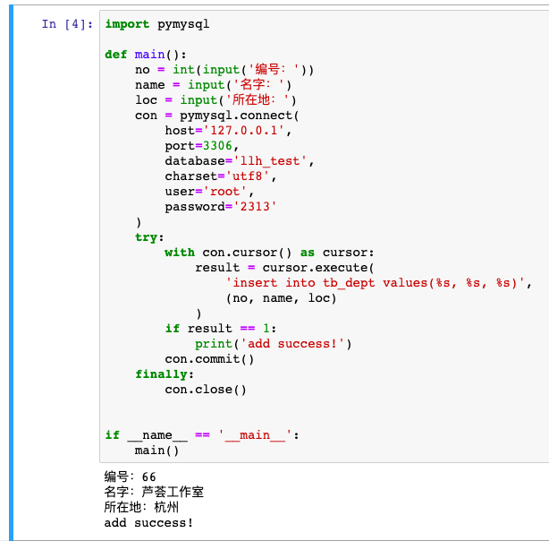
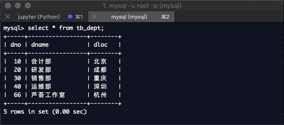
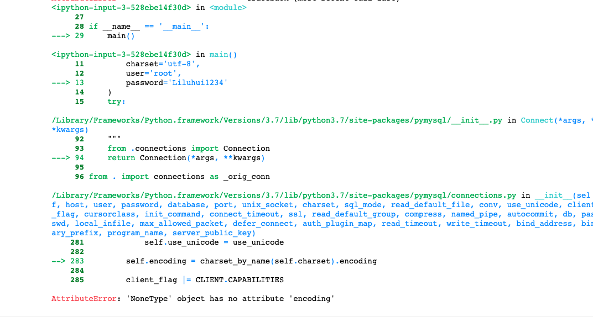
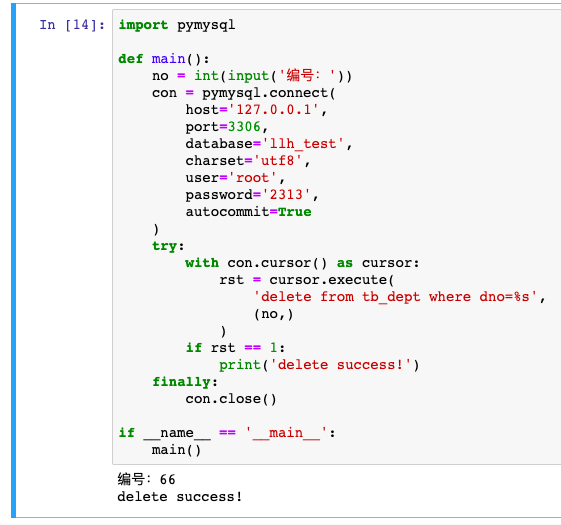
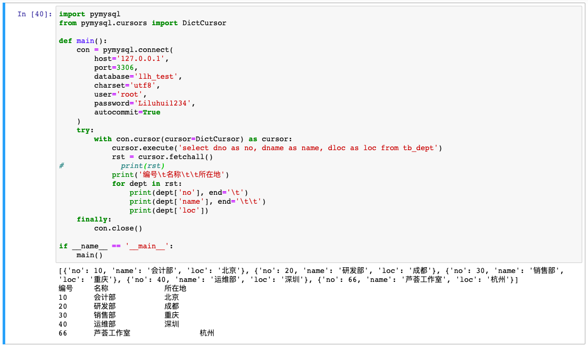
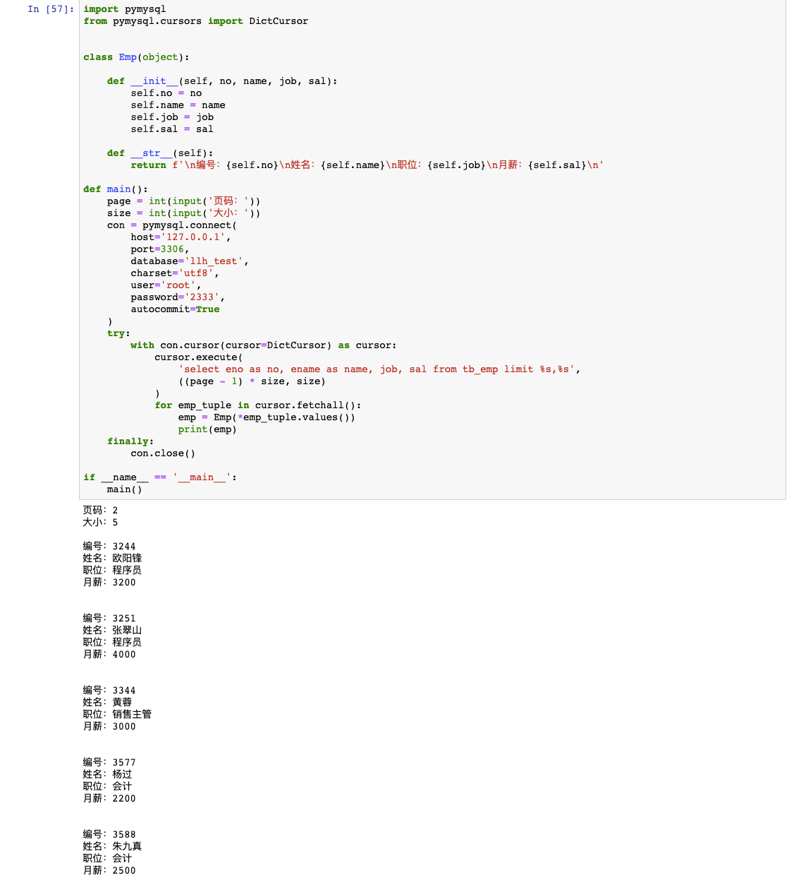

[day36](https://github.com/jackfrued/Python-100-Days/blob/master/Day36-40/36.关系型数据库MySQL.md)

## 学习笔记

### 什么是数据持久化，怎么理解？

> 将数据保存到（在掉电情况下）能够长久保存数据的存储介质中。

其实讲的就是数据存放到磁盘中的技术，数据库就是其中的典型场景。

对于数据来说存储在内存和磁盘中的存储模型是不一样的，数据持久化正式对存储模型转化的统称。


### 关系型数据库


- 关系型数据库是依据关系模型来创建的数据库。
- 所谓关系模型就是“一对一、一对多、多对多”等关系模型，关系模型就是指二维表格模型,因而一个关系型数据库就是由二维表及其之间的联系组成的一个数据组织。
- 关系型数据可以很好地存储一些关系模型的数据，比如一个老师对应多个学生的数据（“多对多”），一本书对应多个作者（“一对多”），一本书对应一个出版日期（“一对一”）关系模型是我们生活中能经常遇见的模型，存储这类数据一般用关系型数据库
- 关系模型包括数据结构（数据存储的问题，二维表）、操作指令集合（SQL语句）、完整性约束(表内数据约束、表与表之间的约束)。 

**关系型数据库瓶颈**

- 高并发读写需求
网站的用户并发性非常高，往往达到每秒上万次读写请求，对于传统关系型数据库来说，硬盘I/O是一个很大的瓶颈
- 海量数据的高效率读写
网站每天产生的数据量是巨大的，对于关系型数据库来说，在一张包含海量数据的表中查询，效率是非常低的
- 高扩展性和可用性
在基于web的结构当中，数据库是最难进行横向扩展的，当一个应用系统的用户量和访问量与日俱增的时候，数据库却没有办法像web server和app server那样简单的通过添加更多的硬件和服务节点来扩展性能和负载能力。对于很多需要提供24小时不间断服务的网站来说，对数据库系统进行升级和扩展是非常痛苦的事情，往往需要停机维护和数据迁移。


**范式理论 - 设计二维表的指导思想**
- 第一范式：数据表的每个列的值域都是由原子值组成的，不能够再分割。
- 第二范式：数据表里的所有数据都要和该数据表的键（主键与候选键）有完全依赖关系。
- 第三范式：所有非键属性都只和候选键有相关性，也就是说非键属性之间应该是独立无关的。


**E-R图**
实体 - 矩形框
属性 - 椭圆框
关系 - 菱形框
重数 - 1:1 / 1:N / M:N

未展开学习

### SQL 语言四大类

**1. 数据定义语言DDL（data definition language）**
数据定义语言DDL用来创建数据库中的各种对象-----表、视图、索引、同义词、聚簇等如：
CREATE TABLE/VIEW/INDEX/SYN/CLUSTER
DDL操作是隐性提交的！不能rollback 

**2 .数据操纵语言DML （data manipulation language）**
数据操纵语言DML主要有三种形式：
1) 插入：INSERT
2) 更新：UPDATE
3) 删除：DELETE

**3. 数据查询语言DQL（Data Query Language）**
数据查询语言DQL基本结构是由SELECT子句，FROM子句，WHERE子句组成的查询块：
SELECT <字段名表>
FROM <表或视图名>
WHERE <查询条件>

**4. 数据控制语言DCL（Data Control Language）**
数据控制语言DCL用来授予或回收访问数据库的某种特权，并控制数据库操纵事务发生的时间及效果，对数据库实行监视等。如：
1) GRANT：授权。
2) ROLLBACK [WORK] TO [SAVEPOINT]：回退到某一点。
回滚---ROLLBACK
回滚命令使数据库状态回到上次最后提交的状态。其格式为：
SQL>ROLLBACK


### pymysql模块

CRUD 简单示例

```sql
CREATE TABLE `users` (
    `id` int(11) NOT NULL AUTO_INCREMENT,
    `email` varchar(255) COLLATE utf8_bin NOT NULL,
    `password` varchar(255) COLLATE utf8_bin NOT NULL,
    PRIMARY KEY (`id`)
) ENGINE=InnoDB DEFAULT CHARSET=utf8 COLLATE=utf8_bin
AUTO_INCREMENT=1 ;
```

```python

import pymysql.cursors

# Connect to the database
connection = pymysql.connect(
    host='localhost',
    user='user',
    password='passwd',
    db='db',
    charset='utf8mb4',
    cursorclass=pymysql.cursors.DictCursor
)

try:
    with connection.cursor() as cursor:
        # Create a new record
        sql = "INSERT INTO `users` (`email`, `password`) VALUES (%s, %s)"
        cursor.execute(sql, ('webmaster@python.org', 'very-secret'))

    # connection is not autocommit by default. So you must commit to save
    # your changes.
    connection.commit()

    with connection.cursor() as cursor:
        # Read a single record
        sql = "SELECT `id`, `password` FROM `users` WHERE `email`=%s"
        cursor.execute(sql, ('webmaster@python.org',))
        result = cursor.fetchone()
        print(result)finally:
    connection.close()
```


## 练习

### 增







遇到的报错



原因：`charset` 是 `utf8` 而不是 `utf-8`

### 删



### 改


### 查



### 分页查询员工信息

